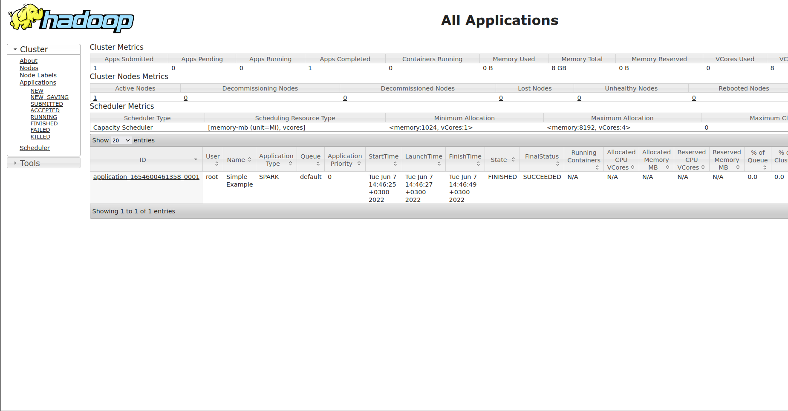

# Apache Hadoop  
### To create a cluster, we will use the Docker image from the [link](https://github.com/big-data-europe/docker-hadoop) 
repository

1. Create directory for project
2. Add file *docker-compose.yml*
3. Add file with variable *hadoop.env*:
```dotenv
CORE_CONF_fs_defaultFS=hdfs://namenode:9000
CORE_CONF_hadoop_http_staticuser_user=root

HDFS_CONF_dfs_webhdfs_enabled=true
HDFS_CONF_dfs_permissions_enabled=false
HDFS_CONF_dfs_namenode_datanode_registration_ip___hostname___check=false

YARN_CONF_yarn_log___aggregation___enable=true
YARN_CONF_yarn_resourcemanager_recovery_enabled=true
YARN_CONF_yarn_resourcemanager_system___metrics___publisher_enabled=true
YARN_CONF_yarn_resourcemanager_hostname=resourcemanager
YARN_CONF_yarn_resourcemanager_address=resourcemanager:8032
YARN_CONF_yarn_resourcemanager_scheduler_address=resourcemanager:8030
YARN_CONF_yarn_resourcemanager_resource__tracker_address=resourcemanager:8031
YARN_CONF_yarn_timeline___service_enabled=true
YARN_CONF_yarn_nodemanager_remote___app___log___dir=/app-logs
```
4. We start the cluster services using the command: `docker-compose up -d`
5. Service interfaces will be available via URLs:
- *NameNade*: [http://0.0.0.0:9870/dfshealth.html#tab-overview](http://0.0.0.0:9870/dfshealth.html#tab-overview)
- *DataNode*: [http://0.0.0.0:9864/datanode.html](http://0.0.0.0:9864/datanode.html)
- *ResourseManager*: [http://0.0.0.0:8088/cluster/apps](http://0.0.0.0:8088/cluster/apps)
- *NodeManager*: [http://0.0.0.0:8042/node](http://0.0.0.0:8042/node)


### Building an Apache Spark Application

Next, we will write a simple Spark application and run it
on a Hadoop cluster. For example, let's take the [Historical 
Daily Weather Data 2020](https://www.kaggle.com/datasets/vishalvjoseph/weather-dataset-for-covid19-predictions) dataset containing historical daily 
weather data for 163 countries from January 1, 2020 to April
21, 2020. Let's group it by country and by short description
(“Country/Region” and “icon” columns) and save the result to
HDFS

1. Copy the dataset to HDFS:
```
docker cp ./daily_weather_2020.csv namenode:/usr/src/daily_weather_2020.csv
docker exec -it namenode bash
hadoop fs -moveFromLocal /usr/src/daily_weather_2020.csv /

```
2. We check that the CSV file was copied successfully
through the web interface [http://0.0.0.0:9870/explorer.html#/](http://0.0.0.0:9870/explorer.html#/)
3. We create a python module [app.py](/hadoop_education/app.py) containing the processing code for our dataset:
```python
from pyspark.sql import SparkSession

def main():
   spark = (SparkSession
            .builder
            .appName('Simple Example')
            .getOrCreate())

   (spark
    .read.csv('hdfs://namenode:9000/daily_weather_2020.csv',
              header=True)
    .groupby('Country/Region', 'icon').count()
    .coalesce(1)
    .write.csv('hdfs://namenode:9000/daily_weather_2020_by_country/',
               header=True, mode='overwrite'))


if __name__ == '__main__':
   main()

```
4. Create *Dockerfile*:
```dockerfile
FROM bde2020/spark-base:3.1.1-hadoop3.2

ENV ENABLE_INIT_DAEMON false

ENV YARN_CONF_DIR=/etc/hadoop
ENV PYSPARK_PYTHON=python3

COPY requirements.txt /app/
RUN cd /app \
     && pip3 install -r requirements.txt

COPY app.py /app
COPY yarn-site.xml /etc/hadoop/

CMD ["/bin/bash", "/spark/bin/spark-submit", "--master=yarn", "--deploy-mode=client", "/app/app.py"]
```
5. Add file [requirements.txt](/hadoop_education/requirements.txt):
```
pyspark==3.2.1
pip==22.1.2
```
and a [yarn-site.xml](/hadoop_education/yarn-site.xml) 
file with minimal configuration to allow Spark to write 
to HDFS and connect to YARN ResourceManager:
```xml
<?xml version="1.0" encoding="UTF-8"?>
<configuration>
   <property>
       <name>fs.defaultFS</name>
       <value>hdfs://namenode:9000</value>
   </property>
   <property>
       <name>yarn.resourcemanager.hostname</name>
       <value>resourcemanager</value>
   </property>
</configuration>

```
6. Create Docker image:
```
docker build -t simple_example .
```
7. Start *Spark* app:
```
docker run --rm --network hadoop-education_default simple_example
```
use correct *network*, if not if it fails to join, use this command:
```
docker network ls

NETWORK ID     NAME                       DRIVER    SCOPE
30fe67f3ce32   bridge                     bridge    local
ab561d4e5156   docker_default             bridge    local
47fca4d8081a   hadoop_education_default   bridge    local
7203c1e37b05   host                       host      local
f42c42118fba   none                       null      local

```
8. The command was executed successfully, can see on: [http://localhost:8088/cluster/apps](http://localhost:8088/cluster/apps)

9. Copy csv-files on host:
```
docker exec -it namenode bash
hadoop fs -copyToLocal /daily_weather_2020_by_country /usr/src/daily_weather_2020_by_country
exit

docker cp namenode:/usr/src/daily_weather_2020_by_country ./daily_weather_2020_by_country
```
